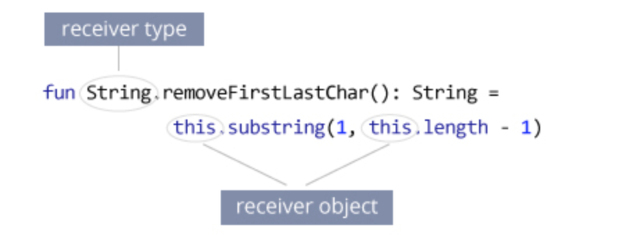

# Control flow


Kotlin has statements for determining what sections of the code will be executed next, during the runtime of a program. These statements are known as control flow statements. 

These statments are:

* If-else
* When
* Loops
* for loops
* while loops
* do-while loops

## If-else
Kotlin’s if-else statements are expressions, not keywords. Which means they can have a value. Consider this example where an if-else expression is used to initialize a variable:
```kotlin
val str: String = if (num < 10) "Lower than 10" else "Equal or greater than 10"
```

## When

Kotlin doesn’t have switch statements, like Java and other popular languages. Switch in other languages is a conditional operator which can be used for comparing multiple conditions on a variable.

In Kotlin this operator is called **when** and does the same job as a switch in other languages.

If when is used as a statement, then it doesn’t have to be exhaustive, that is, not all branches have to be covered, as this example shows:
```kotlin
fun checkNumbers(num: Int) {
    when(num) {
        1 -> println("Number is 1")
        2,3,4,5 -> println("Number is in range from 2 to 5")
    }
}
```

If you are using when as an expression, then it has to be exhaustive
```kotlin
fun checkNumbersExhaustive(num: Int): String {
    return when(num) {
        1 -> "Number is 1"
        2,3,4,5 -> "Number is in range from 2 to 5"
        else -> "Number is higher than 5"
    }
}
```

when accepts any object as its argument, unlike Java’s switch, which accepts only enums, strings and numbers. Here you can see how when can be used for type checking:

```kotlin
fun whenAny(any: Any) {
   when (any) {
      is Int -> println("This is an Int type")
      is Double -> println("This is a Double type")
      is String -> println("This is a String type")
   }
}
```

You can also use when without arguments. You can test against arbitrary boolean conditions inside it. Consider the following example:
```kotlin
fun whenWithoutArgument(a: Int, b: Int) {
   when {
       a * b > 100 -> println("product of a and b is more than 100")
       a + b > 100 -> println("sum of a and b is more than 100")
       a < b -> println("a is less than b")
   }
}
```

## Loops

Kotlin supports standard loops that also exist in other languages, like Java, C++, and others. This includes for loops, while loops and do-while loops.

## for loops
 In Kotlin you use for loop for iterating over anything that provides anIterable interface
 ```kotlin
 for (i: Int in 0..10) {
    println(i)
}
```

The .. syntax creates an  IntRange type which implements the Iterable interface
For loops always use the in keyword for iteration. This keyword can also be used to check if a value is contained inside an Iterable interface:

```kotlin
if (5 in 1..10) print("5 found in range")
```

If you don’t want to include the last number in the range, you can then build it with an until extension function from the Kotlin Standard Library. The following example prints out numbers from 1 to 4:
```kotlin
for (i in 1 until 5) {
  println(i)
}
```

If you need to iterate over a range in reverse order, you can build them with the downTo function. This example prints out numbers from 5 to 1 (1 is included):

```kotlin
fun downToLoop() {
    for (i in 5 downTo 1) {
        println(i)
    }
}
```

## while loops
While loops are the same as in other languages, they will loop until the boolean condition in while is met:
```kotlin
var i = 0
while (i < 10) {
    println("value is $i")
    i += 1
}
```

## do-while loops

The do-while loop is similar to while, the difference is that the do-while loop will always enter the statement, unlike the while loop which might never execute the loop if the while statement is false on start.
```kotlin
 do {
    println("This will be printed only once")
 } 
 ```

 ## Exceptions
 With exception handling features of a language, you can deal with unpredicted situations or exceptional states that can occur while your code is executing. 
 ```kotlin
 val file = File("foo")
var stream: OutputStream? = null
try {
    stream = file.outputStream()
    //do something with stream
} catch (ex: FileNotFoundException) {
    println("File doesn't exist")
} finally {
    if (stream != null) stream.close()
}
```

Exceptions are raised with the  throw keyword. You can create your own Exception types by extending the base Exception class from the Java standard library or by implementing the throwable interface.

Both **try and throws keywords** in Kotlin are expressions, that is, they can return a value. The following example shows how throws can be used as an expression:
```kotlin
val divide = if (divisor > 0) {
    value / divisor
} else {
    throw IllegalArgumentException("Can’t divide with 0")
}
```

Finally, Kotlin doesn’t have checked exceptions. Checked exceptions are a type of exception that have to be either declared or caught in the function in which they are thrown. In other words, they have to be handled explicitly.

## Extension functions
Suppose, you need to extend a class with new functionality. In most programming languages, you either derive a new class or use some kind of design pattern to do this.

However, in Koltin, you can also use extension function to extend a class with new functionality. Basically, an extension function is a member function of a class that is defined outside the class.
Example: Remove First and Last Character of String

```kotlin
fun String.removeFirstLastChar(): String =  this.substring(1, this.length - 1)

fun main(args: Array<String>) {
    val myString= "Hello Everyone"
    val result = myString.removeFirstLastChar()
    println("First character is: $result")
}
```

Here, an extension function removeFirstLastChar() is added to the String class.

The class name is the receiver type (String class in our example). The this keyword inside the extension function refers the receiver object.




