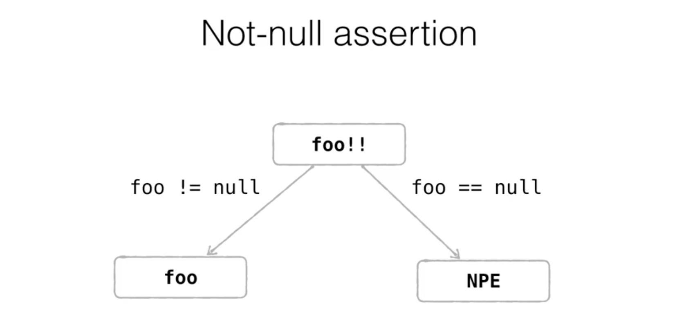

## Nullable types

The problem of nullability is sometimes referred as "Billion Dollar Mistake". That's how Tony Hoare, the inventor of 'null' reference, later called his invention.

The current approach, which is not unique to Kotlin, is to convert these problems, from run-time exceptions to compile-time errors.

```kotlin
val s1:String  = "always not null"
val s2:String? = "can be null or not-null"

s1 -> compile ok
s2 -> does not compile Kotlin: Only safe (?.) or non-null asserted (!!.) calls are allowed on a nullable receiver of type String?
```

## Dealing with Nullable Types
#### What can you do if you want to dereference an object of nullable type?
The easiest way would be to check that explicitly, that your reference is not 'null'. And after that, you can simply dereference it.
```kotlin
val s:String?
if(s.length!=null){
    s.length
}
```

You can replace 'if' expression with 'safe access' expression.
```kotlin
s?.length
```


## Elvis operator
?: takes the right-hand value if the left-hand value is null (the elvis operator)
```kotlin
fun main(args:Array<String>){
    val a: Int? = null
    val b: Int? = 1
    val c: Int = 2

    val s1 = (a ?: 0) + c
    val s2 = (b ?: 0) + c
    print("$s1$s2")
}
return 23
```

## Making NullPointerException explicity
 If you want, you can throw a NullPointerException. For this, you will use this '!!' (two exclamation marks operator) and it throws NullPointerException if its operand is 'null'. 

```kotlin
val s:String?=null
s!!.length  -> Exception in thread "main" kotlin.KotlinNullPointerException
```



## Nullability and Generics.
 Here, in this picture you can see the difference between a list of nullable elements and a nullable list.
 

 ## Safe casts

### **Type cast : as**
```kotlin
if (Any is String){
    val s = Any as String
    s.toUpperCase()
}
```

 