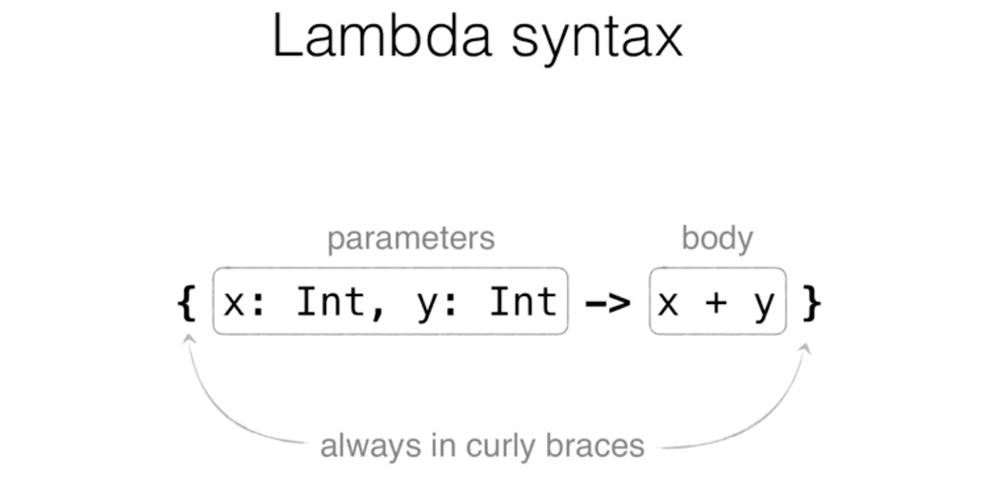

 # Funcional Programming

 In Kotlin, lambda always goes in curly braces

 

If your lambda has the only argument, you can replace its name with **'it'**. It's automatically generated name for your lambda if it has only one argument.
```kotlin
list.any{i->i>0}     equals to   list.any{it>0}
```

 if you want a multi-line lambda, if you want to express some complicated logic, then you just do it, and the last expression of this lambda would be the result.

 ```kotlin
 list.any {
     println("processing $it")
     it>0
 }
 ```

```kotlin
map.mapValues{(key,value) -> "$key -> $value!¨}
```

If one of the lambda's arguments isn't used, you can replace it with ‘_’ (underscore)

```kotlin
map.mapValues{(_,value) -> "$value!¨}
```

## Common Operations on collections

### Filter
## Filters out the content of the list and keeps only the elements that satisfy the predicate.


### Map
## map()' function transforms a collection into a new one, and transforms each element in this collection


### Any (all,none)
## Here we check whether there is at least one even number in the list and the result is 'true'. 'all()' checks whether all elements satisfy the predicate, and 'none()' checks that none of the elements satisfy the given predicate.


### Partition
## partition()' divides the collection into two (collections). 


### Zip


### Flatmap

## Another useful function is 'flatMap()'. This one consists of two operations, the first one is 'map()', and the second one is 'flatten()'. 'map()' in this case should convert each element to a list of elements. Here in this example, we map each string to a list of characters. And in this middle layer, we have a list of lists of elements.

## So what the 'flatten()' function does, it takes a list of lists of elements (as the receiver), and it flattens it. So it returns you just a list of elements as a result; it combines all the elements from all the lists


## Function Types


